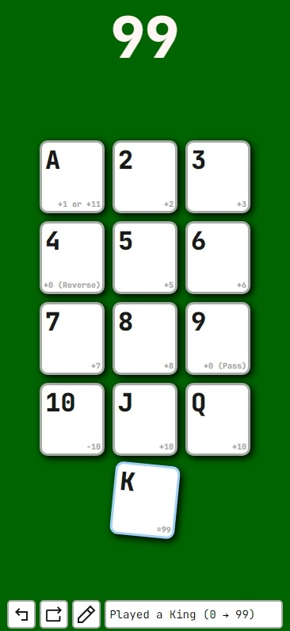

# 99 Total Counter

## Backstory

While on vacation my family discovered the card game [Ninety-Nine](https://bicyclecards.com/how-to-play/99-ninety-nine/) and I was tasked to keep track of the current total. I originally used the calculator app on my phone, but it became quite tedious to convert the cards into their value and then add it to the total. So, I decided to create a simple app to do it for me. It started out as just the counter, but on the 17-hour flight home I added some extra features such as the move history and undo button.

This project was programmed, tested, and debugged all on my phone using [Acode](https://acode.app/).
